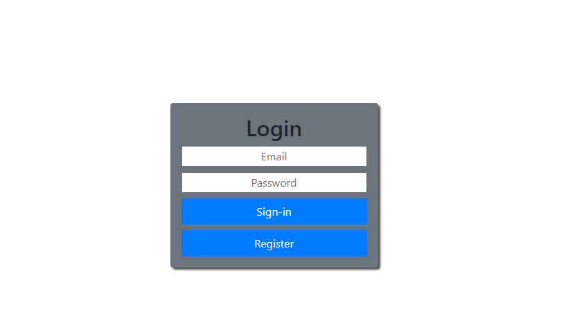
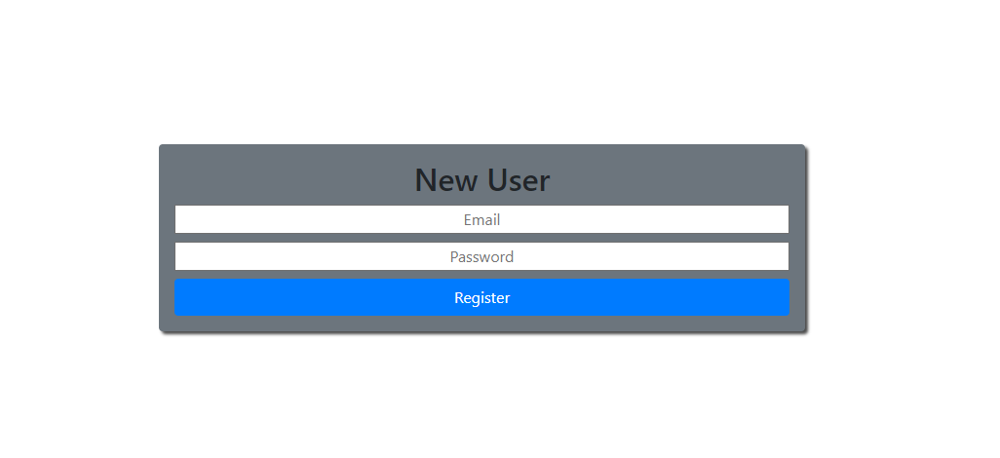

# Login-Sistem
⚒This is the login rest 2.0 with templates and all working and running on heroku. The features added were ,
the error sistem check if is a email, the password length is greater than 6 , and validate if already have 
a user with this email. After this save the user and encrypt you password.And adding the JWT token on cookies and cheking if is a logged user!
# Dependencies

Here have all the dependencies that you need to use it...
-

```bash
  
  $ npm install bcryptjs
  
  $ npm install dotenv
  
  $ npm install ejs
  
  $ npm install express
 
  $ npm install mongoose

  $ npm install nodemon

  $ npm install cookie-parser 
  
  $ npm install jsonwebtoken
  
```

# Observation
  Change the file(.env_sample) to .env, and complete using your own data.\
  Nodemon it's not necessary but if you want change the start to (nodemon app.js)\
  And check if you have [Node](https://nodejs.org/en/).\
  The heroku version don't have the token feature because i just added the token here on GitHub heroku version is the oldest version.\
  On userController file at line 36 have this code (res.redirect(`http://localhost:${PORT}/app`)) if you upload this project on heroku or some host
  change the localhost to your URL. 

# Design



